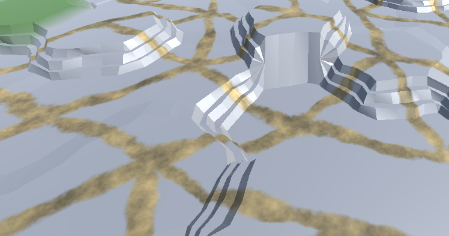
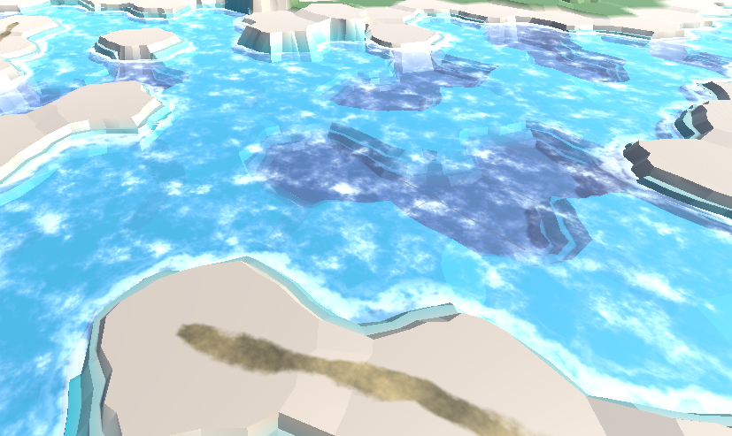
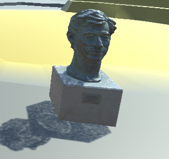
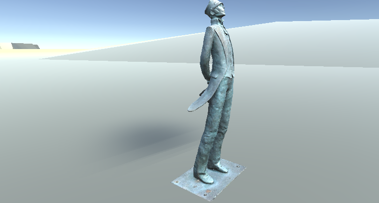
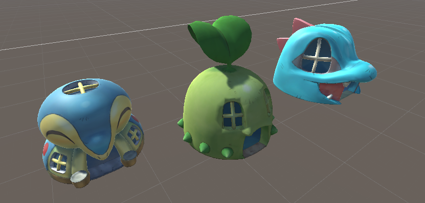
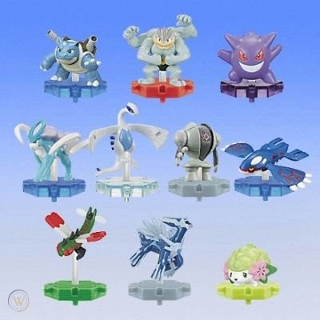
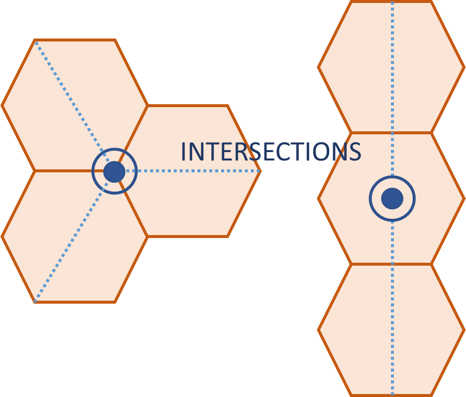

# Génération procédurale : dessin d'une carte en 3D

## Cartes de tuiles hexagonales
Par des Ingénieur Informatique et Multimédia (2022, promotion 6) :

Quentin Robard
Lilian  Sananikone
___

### Inspirations
Principale inspiration : Catan

Il s'agit d'un jeu de société dans lequel on se déplace sur des tuiles hexagonales pour récupérer des ressources.
Chaque tuile a sa propre couleur et propose une ressource particulière.
Il est possible de tracer des chemins entre ces tuiles et de poser des habitations pour cagnoter des ressources.

Inspiration vidéoludique : Northgard

Northgard est un jeu de stratégie temps-réel. Il implique une gestion de ressources disponibles en interagissant avec une carte.
La carte est composée de tuiles hexagonales. C'est plus ou moins ce type de visuel que nous souhaitions reproduire.

### 1ers pas
Nous avons suivi des [tutoriels du site Catlike Coding](https://catlikecoding.com/unity/tutorials/hex-map/) pour tout ce qui concernaient le dessin de la carte.

Dans un 1er temps, nous avons seulement utilisé les éléments du 1er tutotiel pour dessiner des tuiles. Nous souhaitions obtenir un ensemble de routes qui se croisent pour former des villes.
Les routes sont faites à partir de tuiles hexagonales :

Nous avons abandonné cette idée pour suivre au mieux le tutoriel et fournir une grille de tuiles. Nous y avons ajouter des hauteurs à certaines tuiles de manière aléatoire pour créer des reliefs :

## Accentuation des reliefs

### Tracé des routes
Pour le tracé des routes, nous avons repris notre idée de départ. Il s'agit de donner à la route une direction princpale qu'elle suit dans l'ensemble.
On crée la route par petits bouts et à chaque bout posé, on tire dans une pile une direction alétaoire pour créer des petites déviations de la route.
A chaque tirage, la pile change de façon à permettre à la route de suivre sa direction principale et de ne pas piocher tout le temps la même direction.

Pour générer nos routes, nous nous sommes basés sur une génération similaire à celles des niveaux dans le jeu [Spellunky](https://www.youtube.com/watch?v=Uqk5Zf0tw3o&t=3s).

### Génération des rivières

## Placement de modèles 3D

### Choix des modèles 3D
Au début du projet, nous souhaitions reproduire une ville avec des routes composées de tuiles hexagonales.
Pour faire honneur à l'endroit où nous étudions, nous voulions utiliser des modèles 3D significatifs de la ville d'Angoulême.
Pour illuster la ville de la Bande Dessinée, nous utilisons des modèles 3D des statues de Hergé (le créateur de Tintin) et de Corto Maltese.

   

Toutefois, la plupart des modèles 3D de la ville est trop volumineuse et difficile à retravailler pour les adapter à notre projet. C'est le cas des bâtiments.
Pour peupler notre carte d'habitations, nous avons récupérer des modèles d'un jeu Pokémon :

*" Le projet me rappellait des jouets d'enfance Pokémon. C'est des petites créatures qu'on accroche à des pièces hexagonales qui s'assemble pour former un monde : le monde de pokémon.*
*Quand j'allais au supermarché, je dépensais toujours une pièce de 2 euros pour repartir avec un prokémon au hasard.*
*Pour former le monde le plus grand possible, il me fallait beaucoup de pièces hexagonales. Peut importait si j'avais des pokémons en double !"*

*Lilian*

### Evolution de la méthode de placement

Après la réalisation de la grille hexagonale, nous placions cette grille comme étant notre monde.
Dans ce monde, on ajoutait sur les tuiles des objets 3D.
On regardait les voisins de chaque tuile et on plaçait (ou non, car l'objet avait une probalité de ne pas être possitionné) sur l'intersection du voisinage un modèle tiré aléatoirement dans une liste.
L'intersection pouvait être un sommet ou le centre d'une tuile.

Finalement, nous avons décidé de séparer notre mond en plusieus unité dites biomes. Notre 1er biome est une ville.
Les objets posés sur cartes ne sont pas les mêmes et ne sont pas posés de la même manière en fonction du type de biome.
Par rapport à notre système de positionnement précédent, nous avons gardé un principe : On ne pose pas un objet entre des tuiles si elles n'ont pas la même hauteur.
Nous avons terminé par poser des objets à proximité des routes et des rivières.