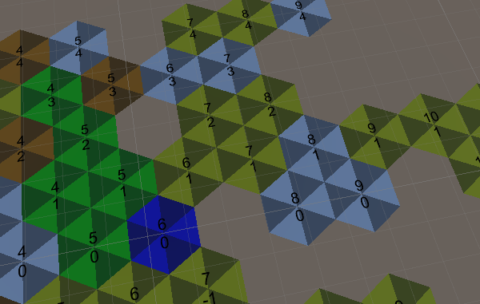
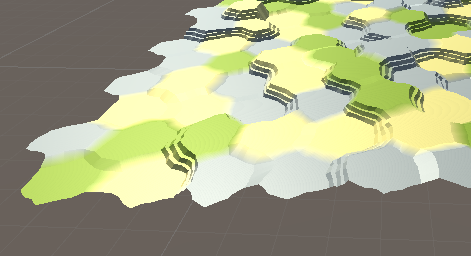

# Génération procédurale : dessin d'une carte en 3D

## Cartes de tuiles hexagonales

### Inspirations
Principale inspiration : Catan

Il s'agit d'un jeu de société dans lequel on se déplace sur des tuiles hexagonales pour récupérer des ressources.
Chaque tuile a sa propre couleur et propose une ressource particulière.
Il est possible de tracer des chemins entre ces tuiles et de poser des habitations pour cagnoter des ressources.

Inspiration vidéoludique : Northgard

Northgard est un jeu de stratégie temps-réel. Il implique une gestion de ressources disponibles en interagissant avec une carte.
La carte est composée de tuiles hexagonales. C'est plus ou moins ce type de visuel que nous souhaitions reproduire.

### 1ers pas
Nous avons suivi des [tutoriels du site Catlike Coding](https://catlikecoding.com/unity/tutorials/hex-map/) pour tout ce qui concernaient le dessin de la carte.

Dans un 1er temps, nous avons seulement utilisé les éléments du 1er tutotiel pour dessiner des tuiles. Nous souhaitions obtenir un ensemble de routes qui se croisent pour former des villes.

Les routes sont faites à partir de tuiles hexagonales :

Nous avons abandonné cette idée pour suivre au mieux le tutoriel et fournir une grille de tuiles. Nous y avons ajouter des hauteurs à certaines tuiles de manière aléatoire pour créer des reliefs :

## Peuplement de la carte

### Tracé des routes

### Tracé des rivières

### Placement de modèles 3D